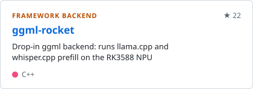
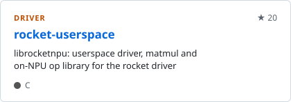
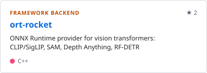
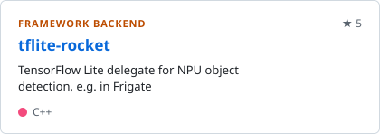
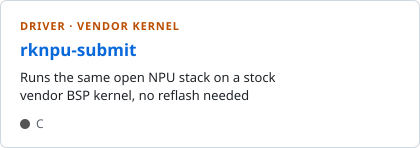
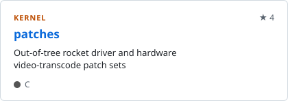
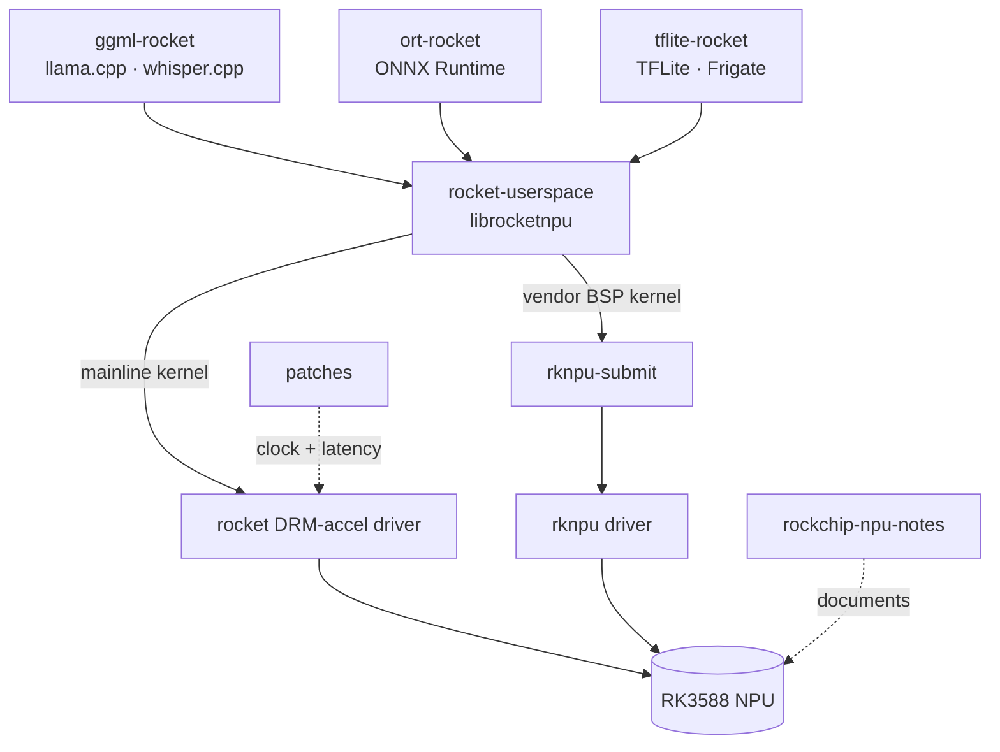

## Hi, I'm Greg

I build open tooling for running mainline Linux on ARM boards, mostly Rockchip: flashing, bring-up, image building, and running models on the NPU. Along the way I write rootless Rust tools that are useful on any Linux machine.

### Rocket NPU

These projects run inference on the RK3588's NPU through the mainline `rocket` DRM-accel driver.

<a href="https://github.com/gregordinary/ggml-rocket"><picture><source media="(prefers-color-scheme: dark)" srcset="cards/ggml-rocket-dark.svg"></picture></a>
<a href="https://github.com/gregordinary/rocket-userspace"><picture><source media="(prefers-color-scheme: dark)" srcset="cards/rocket-userspace-dark.svg"></picture></a>

<a href="https://github.com/gregordinary/ort-rocket"><picture><source media="(prefers-color-scheme: dark)" srcset="cards/ort-rocket-dark.svg"></picture></a>
<a href="https://github.com/gregordinary/tflite-rocket"><picture><source media="(prefers-color-scheme: dark)" srcset="cards/tflite-rocket-dark.svg"></picture></a>

<a href="https://github.com/gregordinary/rknpu-submit"><picture><source media="(prefers-color-scheme: dark)" srcset="cards/rknpu-submit-dark.svg"></picture></a>
<a href="https://github.com/gregordinary/patches"><picture><source media="(prefers-color-scheme: dark)" srcset="cards/patches-dark.svg"></picture></a>

How the stack fits together

---

### Device Bring-up

Getting an OS onto a board: build the image, then flash it.

<dl>
<dt><a href="https://github.com/gregordinary/boot2deb"><b>boot2deb</b></a> <picture><source media="(prefers-color-scheme: dark)" srcset="cards/boot2deb-lang-dark.svg"></picture></dt>
<dd>Builds a bootable Debian image for an SBC, laptop or tablet from layered TOML config, without root.</dd>
<dt><a href="https://github.com/gregordinary/pyrographer"><b>pyrographer</b></a> <picture><source media="(prefers-color-scheme: dark)" srcset="cards/pyrographer-lang-dark.svg"></picture></dt>
<dd>Flashes and recovers Rockchip, StarFive JH7110 and Ingenic devices, from a CLI or a GUI.</dd>
</dl>

---

### Rootless Rust Tooling

Filesystems, sandboxes and packages, all built without root.

<dl>
<dt><a href="https://github.com/gregordinary/ferrosys"><b>ferrosys</b></a> <picture><source media="(prefers-color-scheme: dark)" srcset="cards/ferrosys-lang-dark.svg"></picture></dt>
<dd>Formats and reads ext2/3/4, FAT, exFAT and btrfs images in userspace, with byte-reproducible output.</dd>
<dt><a href="https://github.com/gregordinary/ferroday-cage"><b>ferroday-cage</b></a> <picture><source media="(prefers-color-scheme: dark)" srcset="cards/ferroday-cage-lang-dark.svg"></picture></dt>
<dd>An unprivileged Linux sandbox that can bootstrap a Debian, Alpine or Gentoo root.</dd>
<dt><a href="https://github.com/gregordinary/src2deb"><b>src2deb</b></a> <picture><source media="(prefers-color-scheme: dark)" srcset="cards/src2deb-lang-dark.svg"></picture></dt>
<dd>Builds <code>.deb</code> packages from source inside a sandbox and writes a provenance manifest for each run.</dd>
</dl>

---

### Hardware References

Research notes written to be reused by anyone working with these chips.

<dl>
<dt><a href="https://github.com/gregordinary/rockchip-npu-notes"><b>rockchip-npu-notes</b></a></dt>
<dd>The RK3588 NPU and its regcmd interface, from research and reverse engineering.</dd>
<dt><a href="https://github.com/gregordinary/device-ref"><b>device-ref</b></a></dt>
<dd>RK3288, RK3576 and RK3588 boards on mainline Linux: boot chains, device trees and errata, with every claim graded by its evidence.</dd>
</dl>
